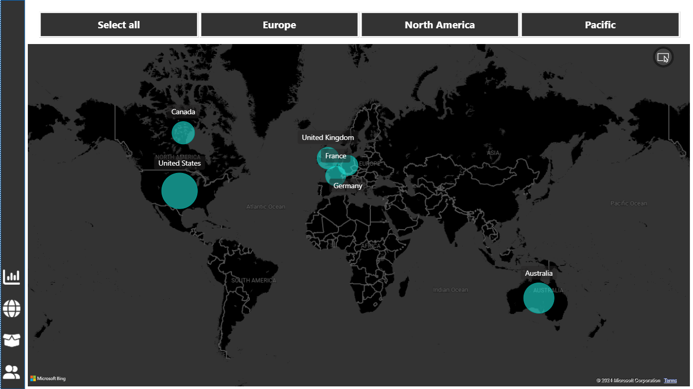
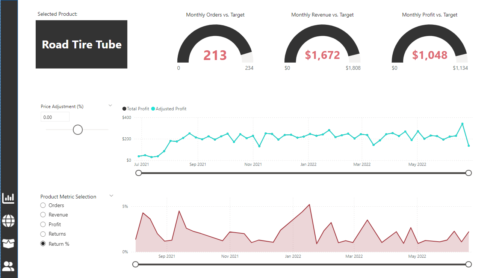
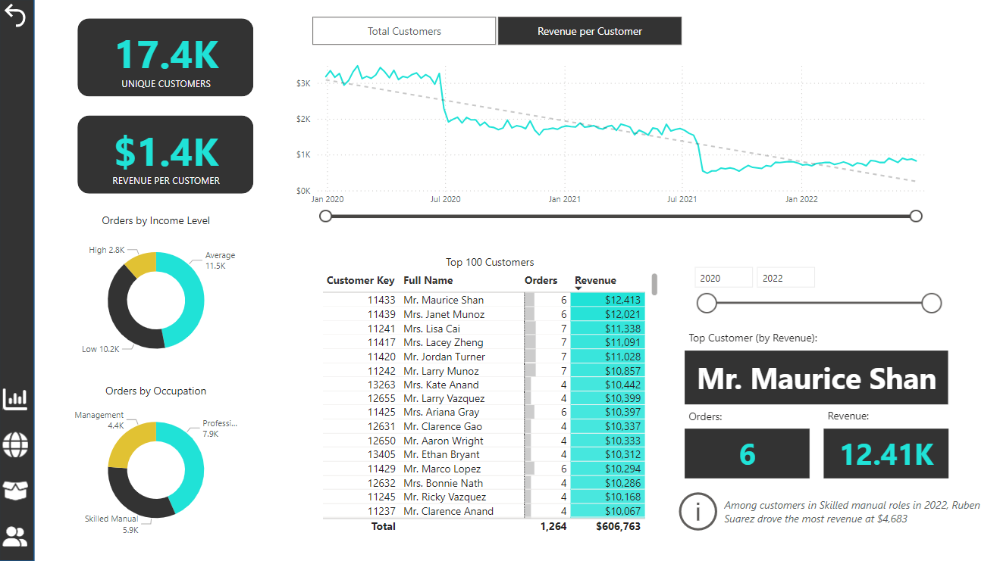
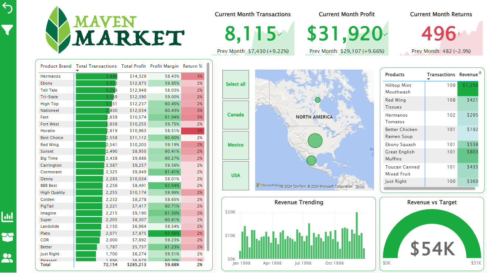
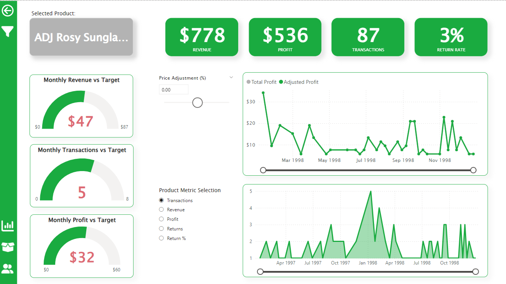
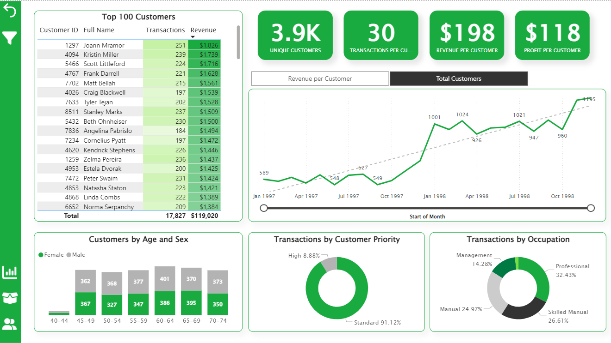

# Power BI Dashboards: A Learning Journey

During my journey through the Udemy course "Microsoft Power BI Desktop for Business Intelligence," I developed and honed my skills in creating interactive and insightful dashboards using Power BI. This project showcases the dashboards I built throughout the course, emphasizing my learning progression and the application of various Power BI features.

You can explore the dashboards here:
- [Adventure Works Dashboard](https://app.powerbi.com/view?r=eyJrIjoiYjdmNDI5MjYtOWQ3Mi00ZGIwLTlmZTAtN2JiODJjYThiYTMzIiwidCI6ImMxYTNmZDRkLTA5MmQtNDRhMS04MWJlLTMyNTdjNzQyY2MxMCIsImMiOjh9)
- [Maven Market Dashboard](https://app.powerbi.com/view?r=eyJrIjoiZTZlMzMyMDQtMTJjNi00MzI5LThiZGItOTcyZTdkZmZjMzI4IiwidCI6ImMxYTNmZDRkLTA5MmQtNDRhMS04MWJlLTMyNTdjNzQyY2MxMCIsImMiOjh9)

## Dashboard Overview

### Adventure Works Dashboard

This dashboard was created following the instructor's guidance, utilizing the Adventure Works database. It consists of four main pages, each enabling different types of analysis:

#### Executive Dashboard

The Executive Dashboard provides a high-level overview of critical business metrics. Users can analyze overall company performance by tracking key indicators such as revenue, profit, orders, and return rate. The dashboard facilitates trend analysis over time and allows users to delve into product-specific performance, helping identify top-performing products and categories. This high-level summary aids in strategic decision-making and performance monitoring.

#### Map

The Map page enables geographic analysis of sales data, showcasing orders by country. Users can filter the data by continent, providing a regional perspective on sales performance. This analysis helps in identifying market trends, regional strengths, and areas needing improvement. It is particularly useful for strategic planning and targeted marketing efforts based on geographical performance.

#### Product Detail

The Product Detail page offers a granular view of individual product performance. Users can assess how specific products are performing against revenue, transaction, and profit targets. The page also allows for dynamic price adjustment analysis, showing potential profit changes over time with different pricing strategies. Additionally, users can track various metrics such as transactions, revenue, profit, and return rates over time, facilitating detailed product management and strategic adjustments.

#### Customer Detail

The Customer Detail page focuses on customer behavior and demographics. It allows users to analyze customer segmentation based on income level and occupation. The page provides insights into unique customers and revenue per customer, helping identify valuable customer segments and trends over time. Additionally, it highlights top customers and their contribution to revenue, enabling targeted customer relationship management and personalized marketing strategies.

[Explore the Adventure Works Dashboard](https://app.powerbi.com/view?r=eyJrIjoiYjdmNDI5MjYtOWQ3Mi00ZGIwLTlmZTAtN2JiODJjYThiYTMzIiwidCI6ImMxYTNmZDRkLTA5MmQtNDRhMS04MWJlLTMyNTdjNzQyY2MxMCIsImMiOjh9)

### Maven Market Dashboard (Final Project)

For the final project, I independently created a dashboard using the Maven Market database, applying the skills and knowledge acquired throughout the course. This dashboard comprises three pages, each enabling different types of analysis:

#### Topline Performance

The Topline Performance page provides an overview of the current month's performance, displaying transactions, profit, and returns. Users can analyze overall performance by product brand and geographical location through matrices and maps. The bar chart tracks revenue trends over time, while the gauge chart compares actual revenue against targets, providing insights into overall business health.

#### Product Detail

The Product Detail page allows users to delve into the performance of individual products. Gauge charts show how well each product meets its monthly targets for revenue, transactions, and profit. Line charts illustrate the impact of price adjustments on total profit over time and enable users to track different performance metrics like transactions, revenue, and returns. This detailed analysis helps in understanding product profitability and making informed pricing decisions.

#### Customer Detail

The Customer Detail page focuses on customer analysis. It provides insights into unique customers, transactions per customer, and revenue per customer. Users can monitor customer behavior trends over time, analyze the top customers by transactions and revenue, and explore customer segmentation by priority and occupation. Additionally, demographic insights into customer age and gender are available, helping in targeting and understanding customer bases.

[Explore the Maven Market Dashboard](https://app.powerbi.com/view?r=eyJrIjoiZTZlMzMyMDQtMTJjNi00MzI5LThiZGItOTcyZTdkZmZjMzI4IiwidCI6ImMxYTNmZDRkLTA5MmQtNDRhMS04MWJlLTMyNTdjNzQyY2MxMCIsImMiOjh9)

### Conclusion

This project showcases the comprehensive learning and practical application of Power BI features gained through the course. The Adventure Works dashboard represents a guided learning experience, while the Maven Market dashboard is a testament to my ability to independently create insightful and interactive dashboards. Through these dashboards, I have demonstrated proficiency in data visualization, geographic analysis, and dynamic reporting.

You can explore more dashboards on my [GitHub repository](https://github.com/daniela-cavalcante?tab=repositories).
