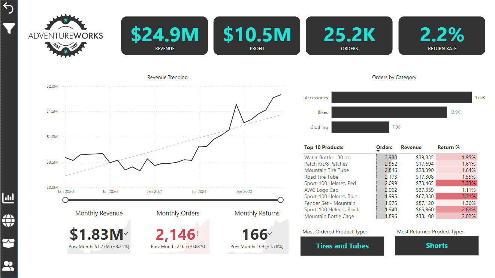

# Power BI Dashboards: A Learning Journey

During my journey through the Udemy course "Microsoft Power BI Desktop for Business Intelligence," I developed and honed my skills in creating interactive and insightful dashboards using Power BI. This project showcases the dashboards I built throughout the course, emphasizing my learning progression and the application of various Power BI features.

You can explore the dashboards here:
- [Adventure Works Dashboard](https://app.powerbi.com/view?r=eyJrIjoiYjdmNDI5MjYtOWQ3Mi00ZGIwLTlmZTAtN2JiODJjYThiYTMzIiwidCI6ImMxYTNmZDRkLTA5MmQtNDRhMS04MWJlLTMyNTdjNzQyY2MxMCIsImMiOjh9)
- [Maven Market Dashboard](https://app.powerbi.com/view?r=eyJrIjoiZTZlMzMyMDQtMTJjNi00MzI5LThiZGItOTcyZTdkZmZjMzI4IiwidCI6ImMxYTNmZDRkLTA5MmQtNDRhMS04MWJlLTMyNTdjNzQyY2MxMCIsImMiOjh9)

## Dashboard Overview

### Adventure Works Dashboard

This dashboard was created following the instructor's guidance, utilizing the Adventure Works database. It consists of four main pages, each enabling different types of analysis:

#### Executive Dashboard

The Executive Dashboard provides a high-level view of key metrics such as unique customers and revenue per customer. Users can track customer growth and revenue trends over time with line charts, and analyze order distribution by income level and occupation through donut charts. The matrix offers a detailed view of the top 100 customers, allowing for in-depth customer revenue analysis, and highlights the top customer by revenue, providing insights into customer value.

#### Map

The Map page allows for geographic analysis of customer distribution and sales performance across various regions including Europe, North America, and the Pacific. Users can identify regional sales trends, evaluate market penetration, and assess geographic performance differences.

#### Product Detail

The Product Detail page is focused on analyzing specific product performance. Users can view detailed metrics for selected products, including monthly orders, revenue, and profit versus targets, through gauge charts. Line charts enable the analysis of profit trends and the impact of price adjustments over time. Additionally, users can select different metrics such as transactions, revenue, profit, returns, and return percentage to track their performance trends.

#### Customer Detail

The Customer Detail page provides insights into customer behavior and demographics. Users can monitor customer acquisition and revenue generation over time through line charts. The matrix showing top customers by transactions and revenue helps in identifying key customers. Donut charts display transaction distribution by customer priority and occupation, while the stacked bar chart offers demographic insights into customer age and gender.

[Explore the Adventure Works Dashboard](https://app.powerbi.com/view?r=eyJrIjoiYjdmNDI5MjYtOWQ3Mi00ZGIwLTlmZTAtN2JiODJjYThiYTMzIiwidCI6ImMxYTNmZDRkLTA5MmQtNDRhMS04MWJlLTMyNTdjNzQyY2MxMCIsImMiOjh9)

### Maven Market Dashboard (Final Project)

For the final project, I independently created a dashboard using the Maven Market database, applying the skills and knowledge acquired throughout the course. This dashboard comprises three pages, each enabling different types of analysis:

#### Topline Performance

The Topline Performance page provides an overview of the current month's performance, displaying transactions, profit, and returns. Users can analyze overall performance by product brand and geographical location through matrices and maps. The bar chart tracks revenue trends over time, while the gauge chart compares actual revenue against targets, providing insights into overall business health.

#### Product Detail

The Product Detail page allows users to delve into the performance of individual products. Gauge charts show how well each product meets its monthly targets for revenue, transactions, and profit. Line charts illustrate the impact of price adjustments on total profit over time and enable users to track different performance metrics like transactions, revenue, and returns. This detailed analysis helps in understanding product profitability and making informed pricing decisions.

#### Customer Detail

The Customer Detail page focuses on customer analysis. It provides insights into unique customers, transactions per customer, and revenue per customer. Users can monitor customer behavior trends over time, analyze the top customers by transactions and revenue, and explore customer segmentation by priority and occupation. Additionally, demographic insights into customer age and gender are available, helping in targeting and understanding customer bases.

[Explore the Maven Market Dashboard](https://app.powerbi.com/view?r=eyJrIjoiZTZlMzMyMDQtMTJjNi00MzI5LThiZGItOTcyZTdkZmZjMzI4IiwidCI6ImMxYTNmZDRkLTA5MmQtNDRhMS04MWJlLTMyNTdjNzQyY2MxMCIsImMiOjh9)

### Conclusion

This project showcases the comprehensive learning and practical application of Power BI features gained through the course. The Adventure Works dashboard represents a guided learning experience, while the Maven Market dashboard is a testament to my ability to independently create insightful and interactive dashboards. Through these dashboards, I have demonstrated proficiency in data visualization, geographic analysis, and dynamic reporting.

You can explore more dashboards on my [GitHub repository](https://github.com/daniela-cavalcante?tab=repositories).
